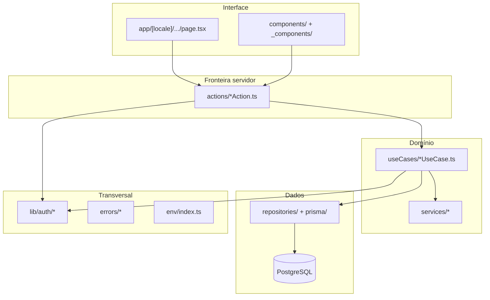

# Arquitetura da aplicação

Este documento descreve a **organização do código** e o **fluxo típico** de uma operação no Zofia Code Labs App.

## Visão em camadas



| Camada | Responsabilidade |
|--------|------------------|
| **Pages / Components** | Renderização, formulários, estados de UI; Server Components quando possível |
| **Server Actions** | `"use server"`, sessão (`auth()`), parse de `FormData`/payload, chamada ao use case, `revalidatePath` |
| **Use Cases** | Regras de negócio, transações, autorização por ativo, orquestração de serviços externos |
| **Repositories** | Acesso Prisma; interfaces em `repositories/I*.ts`, implementações `Prisma*` |
| **Services** | Clientes HTTP para GitHub, SonarQube, Umami, Documenso, storage, etc. |
| **lib/auth** | RBAC, strategies, mapa de rotas, portal do cliente |

Factories em `useCases/**/factories/make*UseCase.ts` montam dependências (padrão simples de injeção manual).

## Fluxo de uma requisição autenticada

1. **`src/proxy.ts`** (middleware Next.js + next-intl + NextAuth):
   - Redireciona não autenticados para login
   - Aplica locale (`pt` / `en`)
   - Valida permissão de rota via `routePermissionMap` (e `clientPortalRouteMap` para OBSERVER)
   - Protege APIs com Bearer ou segredo Documenso no webhook

2. **Page** carrega dados via Server Components, actions ou funções em `_data/` (ex.: `get-cached-*` com `unstable_cache`).

3. **Mutation** dispara Server Action → use case → repositório.

4. **Erros** de domínio estendem `AppError`; actions retornam `{ success, message }` com mensagens i18n via `resolveActionErrorMessage`.

## Estrutura de pastas (principais)

```
src/
├── app/[locale]/
│   ├── (public)/auth/          # Login
│   └── (private)/              # Área autenticada
│       ├── clients/            # CRM + projetos aninhados
│       ├── dashboard/
│       ├── financial/
│       ├── organization/
│       ├── settings/
│       └── ...
├── actions/                    # Server Actions por domínio
├── useCases/                   # Casos de uso + factories
├── repositories/               # Contratos e Prisma
├── services/                   # Integrações externas
├── lib/                        # auth, mailer, prisma, logger
├── components/                 # UI compartilhada
├── schemas/                    # Zod (formulários e APIs)
├── constants/                  # permissions, enums de UI
├── email/                      # Templates React Email
├── errors/                     # Hierarquia de erros
├── env/                        # Validação Zod de env
├── i18n/                       # routing e request config
└── generated/prisma/           # Client Prisma gerado
```

## Padrões adotados

### Server Actions

- Sempre verificar `session?.user` no início
- Validar entrada com schemas Zod em `src/schemas`
- Não expor detalhes internos de erro ao cliente; usar `resolveActionErrorMessage`

### Autorização

- **Rotas**: `canAccessRoute` no proxy (defesa em profundidade na navegação)
- **Recursos**: `checkUserPermissionForAsset(resourceType, userId, asset, operation)` nos use cases
- **Portal**: `assertClientEmployeePermission` para ações do cliente

Ver [permissoes-e-rbac.md](./permissoes-e-rbac.md).

### Internacionalização

- Rotas com prefixo `[locale]`; default `pt`
- Textos em `messages/{locale}.json`
- Erros de negócio mapeados em `lib/i18n/legacyErrorMap.ts` e `resolveErrorMessage`

### Estado de projeto

Transições em `ChangeProjectStatusUseCase` e UI em `@overview/transitions/` com estratégias por destino de status (steps, validações, componentes específicos).

### Cache e revalidação

- `revalidatePath` / `revalidateTag` após mutações
- Dados de dashboard de cliente: helpers `_data/get-cached-*.ts`

## APIs HTTP internas

| Rota | Uso |
|------|-----|
| `/api/auth/[...nextauth]` | Sessão NextAuth |
| `/api/document-sign/webhook` | Webhook Documenso |
| `/api/document-sign/[id]/download` | Download de documento assinado |
| `/api/revalidate` | Revalidação sob demanda |
| `/api/errors` | Log de erros do cliente |

Crons e rotas de forgot-password citadas no `backlog.md` ainda não estão todas implementadas.

## Observabilidade

- Logger: `src/lib/logger.ts` (Pino)
- OpenTelemetry via `@vercel/otel` quando habilitado no deploy

## Referências

- [Modelo de dados](./modelo-de-dados.md)
- [Guia de desenvolvimento](./guia-desenvolvimento.md)
- [Permissões e RBAC](./permissoes-e-rbac.md)
