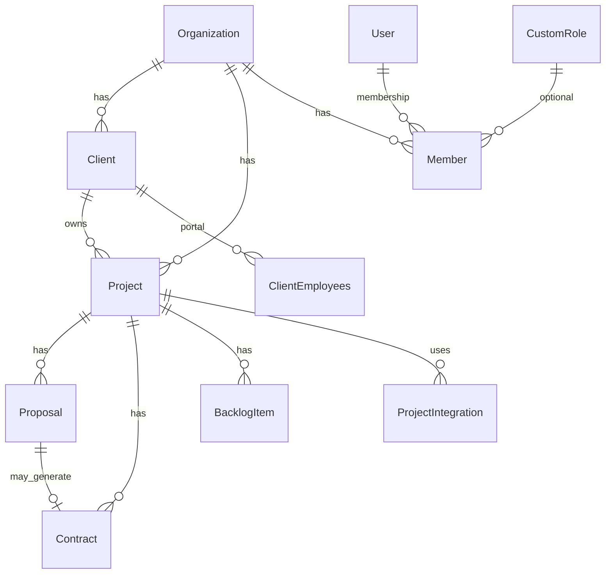

# Modelo de dados

Fonte de verdade: `prisma/schema.prisma`. O PostgreSQL usa **schemas separados** para isolar domínios lógicos no mesmo banco.

## Schemas PostgreSQL

| Schema | Finalidade |
|--------|------------|
| `identity` | Tenants, usuários, membros, papéis, OAuth, sessões |
| `catalog` | Serviços, templates, backlog padrão |
| `crm` | Clientes, propostas, contratos |
| `projects` | Projetos, backlog, sprints, documentos, integrações por projeto |
| `financial` | Despesas, orçamento, faturas |
| `integrations` | Tipos de integração, credenciais, snapshots de métricas |
| `audit` | Logs de auditoria |

## Isolamento multi-tenant

Quase todas as entidades de negócio possuem `organizationId` (ou derivam de `Client` / `Project` que pertencem à organização). Regras de aplicação em `AuthBasePermissionStrategy` rejeitam acesso quando `user.organizationId !== asset.organizationId`.

## Entidades principais

### identity

| Modelo | Notas |
|--------|-------|
| `Organization` | Tenant; `slug` único; `industry`, `settings` JSON |
| `User` | Um usuário por organização no modelo atual; `role` global `OWNER` \| `USER` |
| `Member` | Vínculo usuário ↔ org; `MemberRole`; `customRoleId`; `specificPermissions[]` |
| `CustomRole` | Nome + lista de permissões string por organização |
| `Account` / `Session` | NextAuth |
| `LoginHistory` | IP, user-agent, dispositivo |

### catalog

| Modelo | Notas |
|--------|-------|
| `ServiceCategory` | Agrupamento de tipos de serviço |
| `ServiceType` | Preço base, descrição, vínculo à categoria |
| `ServiceDefaultBacklogItem` | Template de item para sync no projeto |
| `DocumentTemplate` | Conteúdo TipTap (JSON), tipo (proposta, contrato, etc.) |

### crm

| Modelo | Notas |
|--------|-------|
| `Client` | PJ; `@@unique([organizationId, cnpj])`; campos de **responsável legal** |
| `ClientEmployees` | Usuário do portal; `ClientEmployeeRole`, `status` |
| `Proposal` | Versionamento (`version`, `isCurrent`); status e fluxo de aprovação |
| `ProposalItem` | Linhas ligadas a `ServiceType` |
| `Contract` | Vínculo com proposta/projeto; `externalSignId` Documenso |
| `ProposalTemplate` / `ContractTemplate` | Instâncias derivadas de templates |

**Enums relevantes:** `ProposalStatus`, `ContractStatus`, `ProposalSource`, `ClientEmployeeRole`, `ClientEmployeeStatus`.

### projects

| Modelo | Notas |
|--------|-------|
| `Project` | `slug` único global; `ProjectStatus`; cliente e serviços |
| `ProjectMember` | Colaboradores internos no projeto |
| `ProjectDocuments` | Referências de arquivos no storage |
| `ProjectNote` | Observações com autor |
| `BacklogItem` | Prioridade, pontos, ordenação, assignee |
| `Sprint` | Agrupamento temporal de backlog |
| `ProjectIntegration` | Repo Git, site Umami, projeto Sonar, etc. |

### financial

| Modelo | Notas |
|--------|-------|
| `ExpenseCategory` | Por organização |
| `Expense` | Status de aprovação; vínculo a projeto quando aplicável |
| `BudgetEntry` | Orçamento / receita planejada |
| `Invoice` | Faturamento organizacional; campos NFS-e previstos no roadmap |

### integrations

| Modelo | Notas |
|--------|-------|
| `IntegrationType` | Catálogo global (`slug`: github, sonarqube, umami, …) |
| `OrganizationIntegration` | Credenciais/config por tenant |
| `ProjectIntegration` | Liga projeto a uma integração da org |
| `SonarMetricSnapshot` / `UmamiMetricSnapshot` | Histórico para gráficos |
| `WebhookLog` | Rastreio de callbacks |

### audit

| Modelo | Notas |
|--------|-------|
| `AuditLog` | Quem fez o quê, em qual entidade |

## Diagrama simplificado (relacionamentos centrais)



## Migrações

- Pasta: `prisma/migrations/`
- Desenvolvimento: `npx prisma migrate dev`
- Produção (via `npm run build`): `prisma migrate deploy`
- Exemplo recente: `20260530180000_add_client_responsible_fields` — `responsible_name`, `responsible_email`, `responsible_phone` em `crm.clients`

## Cliente Prisma

Gerado em `src/generated/prisma` (não commitar alterações manuais). Import:

```typescript
import { PrismaClient } from "@/generated/prisma/client";
```

Instância singleton: `src/lib/prisma.ts`.

## Soft delete

Várias entidades usam `deletedAt` (ex.: `Client`, `ClientEmployees`). Consultas de listagem devem filtrar registros ativos conforme convenção de cada repositório.

## Referências

- [Permissões e RBAC](./permissoes-e-rbac.md) — recursos mapeados às strategies
- [Integrações](./integracoes.md) — `IntegrationType` e snapshots
